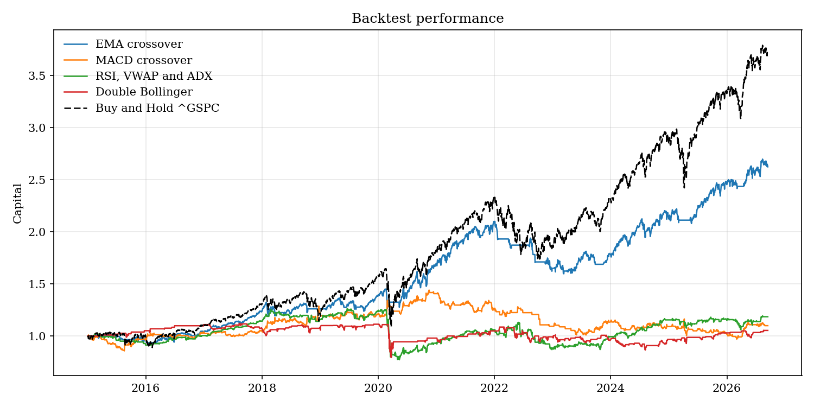

# Technical Analysis Backtests

A short technical analysis backtest.

## Layout

```
src/            Python modules, every parameter declared once in config.py
backtest.ipynb  the four rules, their tables, trades and the capital graph
capital.png     the capital graph, written by the notebook
```
## Strategies

**EMA crossover.** Long only. Enter when the fast average crosses above the slow one, exit on the
opposite cross or on the five per cent stop.

**MACD crossover.** Long and short. Enter when the MACD histogram crosses zero, either way, exit on
the trailing stop.

**RSI, VWAP and ADX.** Long and short. Enter when the histogram is rising, the day is up and RSI,
VWAP and ADX all confirm, exit when the VWAP or the ADX condition turns.

**Double Bollinger, range bounded.** Long and short. Armed when the close goes outside the outer
band, entered on the close back through the inner band, exited at the middle band.

Each rule is stated in full, entry and exit, at the top of `backtest.ipynb`.

## Performance



## Reproducing

Python 3.13 and Jupyter. No compiled dependencies.

```
pip install -r requirements.txt
jupyter lab backtest.ipynb
```

`backtest.ipynb` reports one table and one trade list per rule, plus a single capital graph carrying all four against holding the index. The modules under `src/` are a python library, and prices come from Yahoo Finance.
